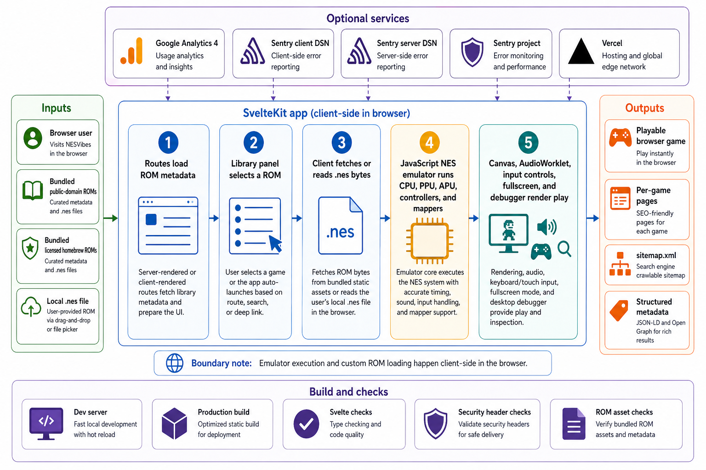

<div align="center">
  

  **Play Nintendo Entertainment System (NES) games online in your browser with bundled homebrew and public-domain ROMs. Vibecoded with GPT-5.4.**

  [Live Demo](https://nesvibes.tsilva.eu)
</div>

NESVibes is a SvelteKit NES player that runs in the browser. It ships with a catalog of public-domain and redistributable homebrew ROMs, plus drag-and-drop support for local `.nes` files.

Pick a bundled game, open a per-game URL, or drop a ROM onto the stage. Gameplay runs client-side with canvas rendering, AudioWorklet sound, keyboard and touch controls, fullscreen mode, and a desktop debugger.

## Install

```bash
git clone https://github.com/tsilva/nesvibes.git
cd nesvibes
pnpm install
pnpm dev
```

Open [http://localhost:5173](http://localhost:5173).

## Commands

```bash
pnpm dev               # start the Vite dev server
pnpm build             # build the SvelteKit app for Vercel
pnpm preview           # preview the production build locally
pnpm check             # run Svelte type and diagnostics checks
pnpm test:emu          # run emulator tests with node:test
pnpm check:headers     # verify the configured security headers
pnpm check:rom-assets  # verify ROM files match the catalogs
pnpm sentry:issues     # list Sentry issues using .env credentials
```

## Notes

- Use `pnpm`; the repo blocks other package managers in `preinstall`.
- The bundled library has 45 cataloged ROMs: 36 public-domain entries and 9 redistributable homebrew entries. 44 are playable today; the mapper-5 TMNT Demo is cataloged but disabled.
- The emulator supports mappers 0, 1, 2, 3, and 4. Trainer ROMs are rejected.
- Keyboard controls are arrow keys for D-pad, `Z` for B, `X` for A, `Enter` for Start, and `Shift` for Select.
- Browser audio may require one user gesture before playback starts.
- Quicklaunch requires HTTP(S). Use the deployed site or a local dev/static server; drag-and-drop still works with local files.
- Optional analytics use `PUBLIC_GOOGLE_ANALYTICS_ID`. Sentry uses `PUBLIC_SENTRY_DSN`, `SENTRY_DSN`, `PUBLIC_SENTRY_ENABLED`, `SENTRY_AUTH_TOKEN`, `SENTRY_ORG`, `SENTRY_PROJECT`, and `SENTRY_BASE_URL`; start from `.env.example`.
- Production deploys through the Vercel adapter and `vercel.json` security headers.

## Architecture



## License

No repository-wide license file is currently included. Bundled ROM license and notice files live beside their assets under `static/roms`.
