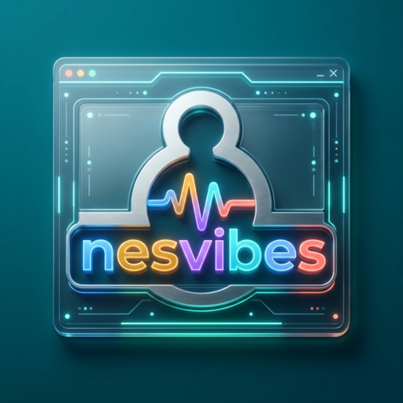

<div align="center">
  

  [](https://kit.svelte.dev/)
  [](https://nesvibes.tsilva.eu)
  [](https://developer.mozilla.org/en-US/docs/Web/JavaScript)

  **Play Nintendo Entertainment System (NES) games online in your browser with bundled homebrew and public-domain ROMs. Vibecoded with GPT-5.4.**

  [Live Demo](https://nesvibes.tsilva.eu) · [GitHub](https://github.com/tsilva/nesvibes)
</div>

---

## 🕹️ Overview

**The Punchline:** nesvibes lets you play Nintendo Entertainment System (NES) games online in your browser with zero downloads.

**The Pain:** Setting up NES emulators means downloading apps, hunting for ROMs, and fiddling with configs — just to play a quick round of a retro game.

**The Solution:** nesvibes is a browser-native NES player built with SvelteKit. It ships with 44 playable bundled ROMs spanning public-domain and redistributable homebrew releases, supports drag-and-drop for your own `.nes` files, and runs entirely client-side.

**The Result:** Open a URL, pick a game, play. Zero setup, works on desktop and mobile. The GPT-5.4 build story stays as a secondary detail, not the reason to click.

<div align="center">

| Metric | Value |
|--------|-------|
| 🎮 Built-in ROMs | 44 playable bundled titles |
| 🗺️ Mappers | 5 (NROM, MMC1, UxROM, CNROM, MMC3) |
| 🔧 Setup | Zero — just open the URL |

</div>

## ✨ Features

- ⚡ **Instant play** — 44 bundled public-domain and licensed homebrew ROMs with quicklaunch sidebar
- 📂 **Drag & drop** — load your own `.nes` files straight from disk
- 🗺️ **5 mapper support** — NROM (0), MMC1 (1), UxROM (2), CNROM (3), MMC3 (4)
- 🔊 **Authentic audio** — pulse, triangle, and noise channels via AudioWorklet
- 🐛 **Built-in debugger** — CPU registers, memory hex viewer, step-through execution
- 📱 **Mobile touch controls** — on-screen D-pad and buttons for phones and tablets
- 🖥️ **Fullscreen mode** — press `F` or click the button for immersive play
- 🎨 **Retro UI** — dark theme with scanline grid, NES-inspired color accents, and Silkscreen font

## 🚀 Quick Start

### Play online

Head to **[nesvibes.tsilva.eu](https://nesvibes.tsilva.eu)** and pick a ROM from the sidebar.

### Run locally

```bash
git clone https://github.com/tsilva/nesvibes.git
cd nesvibes
pnpm install
pnpm dev
```

Build for production:

```bash
pnpm build
```

Enable Google Analytics 4 with a public measurement ID:

```bash
PUBLIC_GOOGLE_ANALYTICS_ID=G-XXXXXXXXXX pnpm dev
```

Enable Sentry locally in dev mode:

```bash
PUBLIC_SENTRY_ENABLED=true pnpm dev
```

Local Sentry settings live in `.env`. Start from the example:

```bash
cp .env.example .env
$EDITOR .env
```

Set the browser/runtime DSN if needed:

```bash
PUBLIC_SENTRY_DSN=https://examplePublicKey@o0.ingest.sentry.io/0 pnpm dev
```

Optionally override the server-side DSN used by SSR and hooks:

```bash
SENTRY_DSN=https://examplePrivateKey@o0.ingest.sentry.io/0 pnpm dev
```

Use the same `.env` file for source map uploads and issue queries:

```bash
SENTRY_AUTH_TOKEN=sntrys_your_token_here pnpm sentry:issues
pnpm build
```

List existing Sentry issues for this project:

```bash
pnpm sentry:issues
```

Run the project checks:

```bash
pnpm check
```

Verify the production security header policy:

```bash
pnpm check:headers
```

Verify the bundled ROM tree only contains catalog-referenced runtime assets:

```bash
pnpm check:rom-assets
```

You can also verify a deployed URL matches the checked-in policy:

```bash
pnpm check:headers -- https://nesvibes.tsilva.eu
```

## 🎮 Controls

### ⌨️ Keyboard

| Key | NES Button |
|-----|------------|
| Arrow keys | D-pad |
| `Z` | B |
| `X` | A |
| `Enter` | Start |
| `Shift` | Select |
| `F` | Fullscreen toggle |

### 📱 Touch

On mobile, on-screen controls appear automatically with a D-pad on the left and action buttons on the right.

> **Note:** Click **Enable Audio** once to unlock browser sound playback before or during play.

## 🐛 Debugger

On desktop viewports (≥981px), a debugger panel docks to the right edge with:

- **CPU registers** — PC, A, X, Y, SP, and status flags
- **Memory viewer** — hex dump with ASCII column, navigate to any address (0000–FFFF)
- **Execution controls** — Play, Pause, and Step for instruction-level debugging

Toggle it with the debug icon in the bottom corner.

## 🗺️ Mapper Support

| Mapper | Name | Status |
|--------|------|--------|
| 0 | NROM | ✅ Supported |
| 1 | MMC1 | ✅ Supported |
| 2 | UxROM | ✅ Supported |
| 3 | CNROM | ✅ Supported |
| 4 | MMC3 | ✅ Supported |
| 5 | MMC5 | ⚠️ Shown but disabled |

## 📁 Project Structure

```
src/
├── lib/
│   ├── emu/
│   │   ├── nes-emulator.js          # Core emulator (~2.5k LOC)
│   │   └── audio-output-worklet.js  # AudioWorklet processor
│   ├── components/
│   │   └── EmulatorDebugger.svelte   # Debugger panel UI
│   └── debugger/
│       └── create-emulator-debugger.js
├── routes/
│   └── +page.svelte                  # Main app shell
└── app.css                           # Global styles

static/roms/pdroms/nes/
├── catalog.json                      # ROM metadata (36 entries)
└── library/                          # Public-domain ROM files
```

## 🛠️ Tech Stack

- **[SvelteKit](https://kit.svelte.dev/)** — app framework with SSR and prerendering
- **[Vite](https://vitejs.dev/)** — dev server and build tool
- **[Vercel](https://vercel.com/)** — deployment platform
- **[Silkscreen](https://fonts.google.com/specimen/Silkscreen)** — retro display font
- **[Lucide](https://lucide.dev/)** — icon library
- **Web Audio API** — AudioWorklet-based sound pipeline

## 📝 Notes

- The bundled ROM library is served from `static/roms/pdroms/nes` and `static/roms/licensed/nes`.
- 45 ROMs are cataloged in total: 36 public-domain entries and 9 redistributable homebrew entries.
- 44 bundled ROMs are launchable with the current mapper set. The mapper-5 TMNT Demo is shown but disabled.
- The emulator runs entirely client-side. Google Analytics is only loaded when `PUBLIC_GOOGLE_ANALYTICS_ID` is set, and it is deferred until after mount so it stays out of the render path.
- Sentry is preconfigured for the `nesvibes` project and defaults to enabled in production builds. Local runtime, build upload, and issue-query settings all come from `.env`. Production uses `PUBLIC_SENTRY_DSN`, and the server runtime can override that with `SENTRY_DSN`. Set `PUBLIC_SENTRY_ENABLED=true` to send events during local development.
- `pnpm sentry:issues` reads `.env` and uses the Sentry API to list existing issues for this project.
- Production deployments attach static security headers from `vercel.json`, including CSP, HSTS, COOP, and clickjacking/content-sniffing protections.

## ⭐ Support

If you enjoy nesvibes, consider [giving it a star on GitHub](https://github.com/tsilva/nesvibes) ⭐
